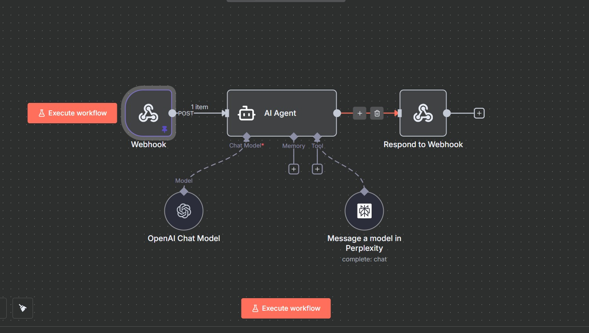
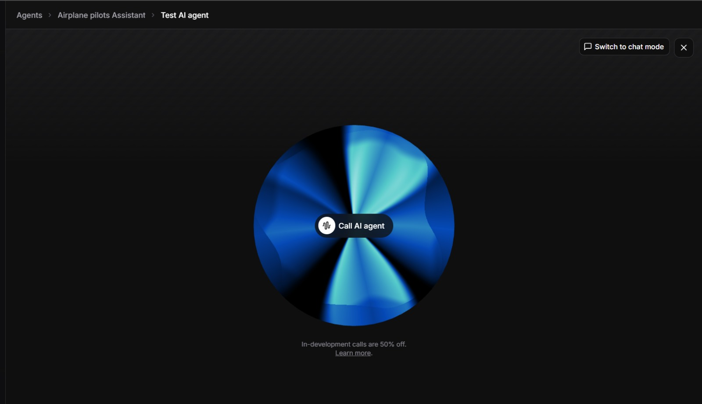
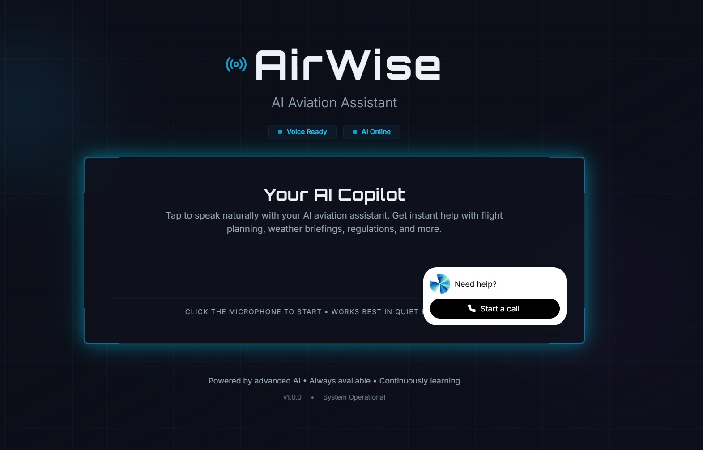

# ✈️ AirWise Pilot Assistant

AirWise Pilot Assistant is an intelligent AI-powered aviation assistant that provides pilots with real-time weather information, flight guidance, and FAA regulatory compliance support through natural voice interactions.

## 🎯 Overview

AirWise Pilot uses advanced AI voice capabilities and automation workflows to deliver a seamless conversational experience for pilots. The assistant can query weather data, provide additional flight information, and ensure compliance with FAA guidelines—all through natural voice commands.

## ✨ Core Capabilities

### Identity & Mission
**AirWise** is an authoritative pilot-assistance system designed for licensed pilots who require fast, accurate, and professional aviation answers. The system operates on a **primary directive**: **ALWAYS PROVIDE AN ANSWER** with confidence and precision.

### Comprehensive Knowledge Base
Built on **RAG (Retrieval-Augmented Generation) architecture**, AirWise has full access to:

- **FAA Regulations** - Complete regulatory framework
- **AIM (Aeronautical Information Manual)** - Aviation procedures and guidance
- **Advisory Circulars (ACs)** - Technical standards and best practices
- **FAA Handbooks** - Pilot training and reference materials
- **POH/AFM** - Pilot Operating Handbooks & Aircraft Flight Manuals
- **QRH** - Quick Reference Handbooks
- **MEL/CDL** - Minimum Equipment Lists & Configuration Deviation Lists
- **ICAO Procedures** - International aviation standards
- **Performance Data** - Aircraft-specific performance metrics
- **Emergency Procedures** - Critical situation handling protocols

### Real-Time Intelligence
When questions require current information, AirWise leverages the **N8N custom tool integration** to retrieve:

- **Live Weather Data** - METARs, TAFs, and current conditions
- **NOTAMs** - Notices to Airmen for airspace and facility updates
- **Airport Information** - Current operational status and details
- **Flight Status** - Real-time flight tracking and updates
- **Web Search Results** - Additional context via Perplexity Sonar API

### Response Characteristics

**Format**: Quick Answer → Detailed Explanation → Operational Note

**Style**:
- ✈️ Direct, concise, and authoritative
- 📚 Uses standard aviation terminology
- 📋 Cites regulations when relevant
- 🎯 Provides precise numbers and specifications
- 🚫 No hedging or vague answers

### Intelligent Context Integration
AirWise automatically integrates:
- Aircraft type and specifications
- Route information and waypoints
- Current weather conditions
- Flight planning data
- **Proactively identifies and calls out safety issues**

### Operational Excellence
The system follows critical operational rules:
1. **Always provide an answer** - Never leave a pilot without guidance
2. **Use contextual awareness** - Integrate all available data
3. **Request real-time data when needed** - Via N8N automation
4. **Maintain precision** - Exact numbers, proper terminology, regulatory citations

## 🏗️ Architecture

### System Flow

1. **Voice Interface** → Eleven Labs AI Agent (with FAA knowledge base)
2. **WebSocket Connection** → Orchestration between Eleven Labs and N8N
3. **Automation & Intelligence** → N8N workflow with Perplexity Sonar API
4. **Response Delivery** → Back through WebSocket to Eleven Labs voice output

### Architecture Diagrams

#### N8N Automation Workflow

*The N8N automation workflow handles intelligent query processing, weather data retrieval, and information synthesis using the Perplexity Sonar search model API.*

#### Eleven Labs AI Agent

*Eleven Labs AI agent configured with FAA guidelines knowledge base for accurate and compliant aviation assistance.*

#### AirWise Pilot Application

*The complete AirWise Pilot assistant interface providing seamless voice interactions for pilots.*

## 🛠️ Tech Stack

### Frontend
- **React 18** - Modern UI library
- **TypeScript** - Type-safe development
- **Vite** - Fast build tool and dev server
- **Tailwind CSS** - Utility-first styling
- **shadcn/ui** - Beautiful, accessible UI components
- **Radix UI** - Headless component primitives
- **Framer Motion** - Smooth animations
- **Wouter** - Lightweight routing

### Backend
- **Express.js** - Web server framework
- **TypeScript** - Type-safe server code
- **WebSocket (ws)** - Real-time bidirectional communication
- **Drizzle ORM** - Type-safe database toolkit
- **Neon Database** - Serverless PostgreSQL
- **Passport.js** - Authentication middleware

### AI & Automation
- **Eleven Labs** - AI voice agent with:
  - Natural voice synthesis
  - Voice recognition
  - FAA guidelines knowledge base
  - Real-time conversation handling
- **N8N** - Workflow automation platform for:
  - WebSocket orchestration
  - API integrations
  - Data processing and routing
- **Perplexity Sonar** - Advanced search model API for:
  - Real-time weather queries
  - Aviation information retrieval
  - Contextual data synthesis

### Development Tools
- **tsx** - TypeScript execution
- **ESBuild** - Fast JavaScript bundler
- **Drizzle Kit** - Database migrations
- **cross-env** - Cross-platform environment variables

## 🚀 Getting Started

### Prerequisites
- Node.js (v18 or higher)
- npm or yarn package manager

### Installation

1. **Clone the repository**
```bash
git clone <repository-url>
cd AirWisePilot
```

2. **Install dependencies**
```bash
npm install
```

3. **Set up environment variables**
Create a `.env` file in the root directory with your configuration:
```env
PORT=3000
DATABASE_URL=your_neon_database_url
ELEVEN_LABS_API_KEY=your_eleven_labs_key
N8N_WEBHOOK_URL=your_n8n_webhook_url
PERPLEXITY_API_KEY=your_perplexity_api_key
```

4. **Run database migrations**
```bash
npm run db:push
```

5. **Start the development server**
```bash
npm run dev
```

The application will be available at `http://localhost:3000`

### Building for Production

```bash
npm run build
npm start
```

## 📋 Available Scripts

- `npm run dev` - Start development server with hot reload
- `npm run build` - Build for production
- `npm start` - Run production server
- `npm run check` - Type check with TypeScript
- `npm run db:push` - Push database schema changes

## 🎙️ How It Works

### 1. Voice Interaction Entry Point
The user interacts with the AirWise Pilot through voice commands powered by Eleven Labs AI agent. The agent is equipped with a comprehensive FAA guidelines knowledge base to ensure all responses are compliant and accurate.

### 2. WebSocket Orchestration
Real-time bidirectional communication is established between:
- **Eleven Labs** ↔️ **N8N Automation Workflow** ↔️ **Application Backend**

### 3. Intelligent Query Processing
When a query is received (e.g., weather information request):
1. N8N automation workflow receives the query via WebSocket
2. The workflow processes the request using the Perplexity Sonar search model API
3. Relevant weather data and additional aviation information is retrieved
4. The information is synthesized and formatted

### 4. Response Delivery
1. Processed information is sent back through the N8N workflow
2. Data is transmitted to Eleven Labs via WebSocket
3. Eleven Labs converts the response to natural voice
4. The pilot receives the information through voice output

### 5. Knowledge Base Integration
The Eleven Labs agent continuously references the FAA guidelines knowledge base to ensure:
- Regulatory compliance
- Accurate aviation terminology
- Safety-first recommendations
- Industry best practices

## 🔐 Security Considerations

- All API keys should be stored in environment variables
- WebSocket connections should be secured with proper authentication
- Database credentials must be kept confidential
- Implement rate limiting for API endpoints

## 🤝 Contributing

Contributions are welcome! Please feel free to submit a Pull Request.

## 📄 License

MIT License - see the LICENSE file for details

## 🆘 Support

For issues, questions, or contributions, please open an issue in the repository.

---

**Built with ❤️ for safer skies and smarter aviation**
